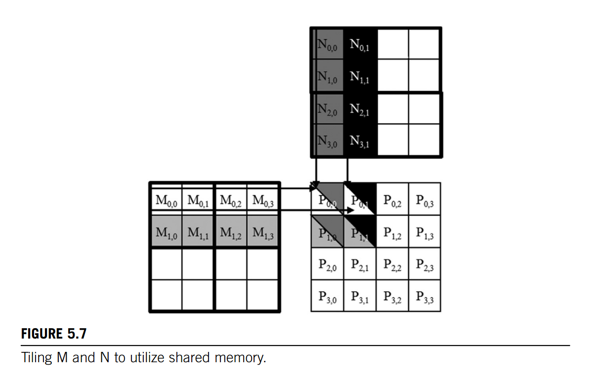

# Excercises-5

1. Consider matrix addition. Can one use shared memory to reduce the global memory bandwidth consumption? Hint: Analyze the elements that are accessed by each thread and see whether there is any commonality between threads.

    NO. Because matrix addition use every element in matrix only once.

2. Draw the equivalent of Fig. 5.7 for a 8\*8 matrix multiplication with 2\*2 tiling and 4\*4 tiling. Verify that the reduction in global memory bandwidth is indeed proportional to the dimension size of the tiles.

    
    对于 8\*8 matrix, 不考虑tiling总共需要访问 (8+8)\*(8\*8) = 16 \* 64 = 1024 次内存；
    1. 使用 2\*2 tiling, 需要分8\*8 / 2\*2 = 16 块，每一块访问了8\*4 = 32次内存，总共需要访问32\*16 = 512 次内存
    2. 使用 4\*4 tiling, 需要分8\*8 / 4\*4 = 4 块，每一块访问了8\*8 = 64次内存，总共需要访问64\*4 = 256 次内存
    因此我们可以看出随着tiling规模的扩大，访问内存的次数变少。1024->512->256

3. What type of incorrect execution behavior can happen if one forgot to use one or both __syncthreads() in the kernel of Fig. 5.9?

    
    1. 对于第21行的```__syncthreads()``` 来说，如果没有使用，将会导致写前读的问题发生，也就是某些线程在我们写入数据之前已经执行到for循环了导致结果出错；
    2. 对于第26行的```__syncthreads()``` 来说，缺少了可能会出现读取了新的元素覆盖了原本要读的数据，也就是写后读问题；

4. Assuming that capacity is not an issue for registers or shared memory, give one important reason why it would be valuable to use shared memory instead of registers to hold values fetched from global memory? Explain your answer.

    Global memory读取速度比shared_memory 慢，在同一个block可以共享shared_memory里面的内容，所以利用shared_memory 存储必要的内容，然后再由registers去访问会更方便快捷；
5. For our tiled matrix-matrix multiplication kernel, if we use a 32 \* 32 tile, what is the reduction of memory bandwidth usage for input matrices M and N?

    理想状态下是原来1/32 的内存访问次数，但是由于边界的存在实际上可能>1/32 的次数；
6. Assume that a CUDA kernel is launched with 1000 thread blocks, each of which has 512 threads. If a variable is declared as a local variable in the kernel, how many versions of the variable will be created through the lifetime of the execution of the kernel?

    Local variable are stored in registers, so there are 1000*512 = 512000 creations of this variable.
7. In the previous question, if a variable is declared as a shared memory variable, how many versions of the variable will be created through the lifetime of the execution of the kernel?

    Shared memory variable are stored in shared_memory which is binded with the number of blocks, so there are 1000 creations of this variable.
8. Consider performing a matrix multiplication of two input matrices with dimensions N \* N. How many times is each element in the input matrices requested from global memory when:

    a. There is no tiling?

        (N+N)*(N*N) = 2N*N^2 = 2N^3

    b. Tiles of size T \* T are used?

        (N*T*2)*((N*N)/(T*T)) = 2NT * N^2 / T^2 = 2N^3/T

9. A kernel performs 36 floating-point operations and seven 32-bit global memory accesses per thread. For each of the following device properties, indicate whether this kernel is compute-bound or memory-bound.

    32 bits = 4 Bytes, 7*4 = 28 Bytes/thread.

    a. Peak FLOPS=200 GFLOPS, peak memory bandwidth=100 GB/second

        200/36 = 5.56*10^9 Threads/second
        8.34*10^9 * 28 = 144.87 GB/second > 100 GB/second
        So a is memory-bound
    b. Peak FLOPS=300 GFLOPS, peak memory bandwidth=250 GB/second

        300/36 = 8.34*10^9 Threads/second
        8.34*10^9 * 28 = 217.31 GB/second < 250 GB/second
        So b is compute-bound

10. To manipulate tiles, a new CUDA programmer has written a device kernel that will transpose each tile in a matrix. The tiles are of size BLOCK_WIDTH by BLOCK_WIDTH, and each of the dimensions of matrix A is known to be a multiple of BLOCK_WIDTH. The kernel invocation and code are shown below. BLOCK_WIDTH is known at compile time and could be set anywhere from 1 to 20.

    ```C++
    dim3 blockDim(BLOCK_WIDTH,BLOCK_WIDTH);
    dim3 gridDim(A_width/blockDim.x, A_height/blockDim.y);
    BlockTranspose<<<gridDim, blockDim>>>(A, A_width, A_height);

    __global__ void BlockTranspose(float* A_elements, int32_t A_width, int32_t A_height){
        __shared__ float blockA[BLOCK_WIDTH][BLOCK_WIDTH];

        int32_t baseIdx = blockIdx.x * BLOCK_SIZE + threadIdx.x;
        baseIdx += (blockIdx.y * BLOCK_SIZE + threadIdx.y) * A_width;

        blockA[threadIdx.y][threadIdx.x] = A_elements[baseIdx];

        A_elements[baseIdx] = blockA[threadIdx.x][threadIdx.y];
    }
    ```

    a. Out of the possible range of values for BLOCK_SIZE, for what values of BLOCK_SIZE will this kernel function execute correctly on the device?

    除了1-20之外，只要是A矩阵行和列的公因数即可。

    b. If the code does not execute correctly for all BLOCK_SIZE values, what is the root cause of this incorrect execution behavior? Suggest a fix to the code to make it work for all BLOCK_SIZE values.

    在执行赋值给A_elements[] 之前，采用```__syncthreads();```，如果不加上会出现写前读的问题，blockA[][]的数据还未写入就执行到赋值从而导致出错。

    ```C++
    dim3 blockDim(BLOCK_WIDTH,BLOCK_WIDTH);
    dim3 gridDim(A_width/blockDim.x, A_height/blockDim.y);
    BlockTranspose<<<gridDim, blockDim>>>(A, A_width, A_height);

    __global__ void BlockTranspose(float* A_elements, int32_t A_width, int32_t A_height){
        __shared__ float blockA[BLOCK_WIDTH][BLOCK_WIDTH];

        int32_t baseIdx = blockIdx.x * BLOCK_SIZE + threadIdx.x;
        baseIdx += (blockIdx.y * BLOCK_SIZE + threadIdx.y) * A_width;

        blockA[threadIdx.y][threadIdx.x] = A_elements[baseIdx];

        __syncthreads();

        A_elements[baseIdx] = blockA[threadIdx.x][threadIdx.y];
    }
    ```

11. Consider the following CUDA kernel and the corresponding host function that calls it:

    ```C++
    __global__ void foo_kernel(float* a, float* b) {
        uint32_t i = blockIdx.x*blockDim.x + threadIdx.x;
        float x[4];
        __shared__ float y_s;
        __shared__ float b_s[128];
        for(uint32_t j = 0; j < 4; ++j){
            x[j] = a[j*blockDim.x*gridDim.x + i];
        }
        if(threadIdx.x == 0){
            y_s = 7.4F;
        }
        b_s[threadIdx.x] = b[i];
        __syncthreads();
        b[i] = 2.5F*x[0] + 3.7F*x[1] + 6.3F*x[2] + 8.5F*x[3]
                + y_s*b_s[threadIdx.x] + b_s[(threadIdx.x + 3)%128];
    }
    void foo(int32_t* a_d, int32_t* b_d){
        uint32_t N = 1024;
        foo_kernel <<< (N + 128 -1)/128, 128>>>(a_d, b_d);
    }
    ```

    ((1024+128-1) /128) = 9 blocks
    9\*128 = 1152 threads

    a. How many versions of the variable i are there? 1152

    b. How many versions of the array x[] are there? 1152

    c. How many versions of the variable y_s are there? 9

    d. How many versions of the array b_s[] are there? 9

    e. What is the amount of shared memory used per block (in bytes)?

        For each block: y_s 4Bytes, b_s 128*4Bytes = 512Bytes, total memory is 4 + 512 = 516 Bytes

    f. What is the floating-point to global memory access ratio of the kernel (in OP/B)?

    ```C++
    b[i] = 2.5F*x[0] + 3.7F*x[1] + 6.3F*x[2] + 8.5F*x[3] + y_s*b_s[threadIdx.x] + b_s[(threadIdx.x + 3)%128];
    ```

    Floating-point operation for per thread is 10;

    global memory access: 4+1 = 5 float, 5*4Bytes = 20Bytes

    floating-point to global memory access ratio of the kernel is 10/20 = 0.5 OP/B;
12. Consider a GPU with the following hardware limits: 2048 threads/SM, 32 blocks/SM, 64K (65,536) registers/SM, and 96 KB of shared memory/SM. For each of the following kernel characteristics, specify whether the kernel can achieve full occupancy. If not, specify the limiting factor.

    MaxWarpsPerSM: 2048 / 32 = 64warps/SM
    MaxRegistersPerThread: 65536/2048 = 32 registers/thread = 1024 registers/warps

    a. The kernel uses 64 threads/block, 27 registers/thread, and 4 KB of shared memory/SM.

        The number of registers required for one warp is: 
        (27*32 / 1024)*1024 = 1024
        The number of maximum active warps per multiprocessor given the warp allocation granularity is:
        65536/1024 = 64
        64/32 = 2warps/block  we can run at most 64/2 = 32 thread blocks.
        the occupancy is 32*2/64 * 100% = 100%
        So a kernel can reach full occupancy;

    b. The kernel uses 256 threads/block, 31 registers/thread, and 8 KB of shared memory/SM.

        The number of registers required for one warp is: 
        (31*32 / 1024)*1024 = 1024
        The number of maximum active warps per multiprocessor given the warp allocation granularity is:
        65536/1024 = 64
        256/32 = 8warps/block  we can run at most 64/8 = 8 thread blocks.
        the occupancy is 8*8/64 * 100% = 100%
        So a kernel can reach full occupancy;

    reference: https://leimao.github.io/blog/CUDA-Occupancy-Calculation/
