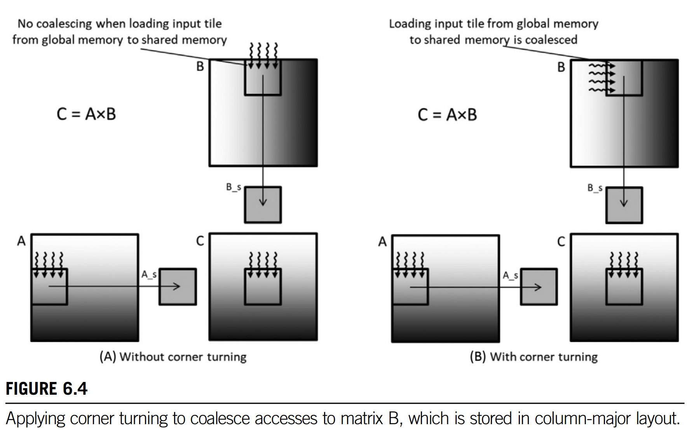
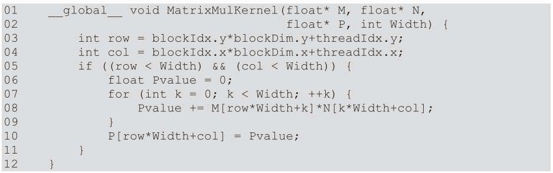
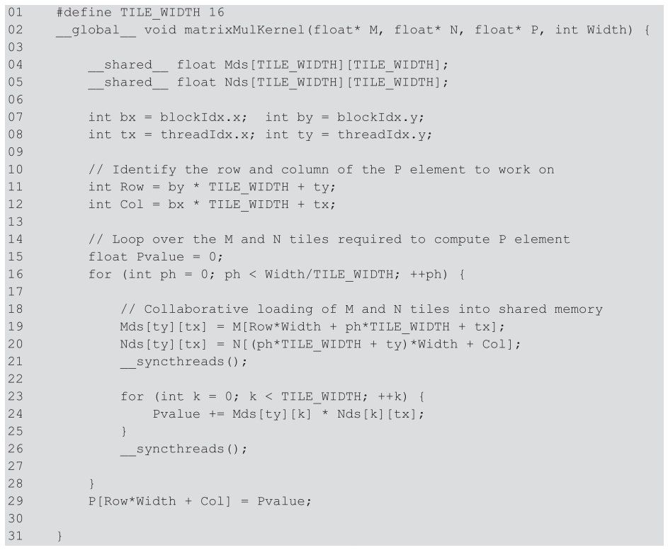
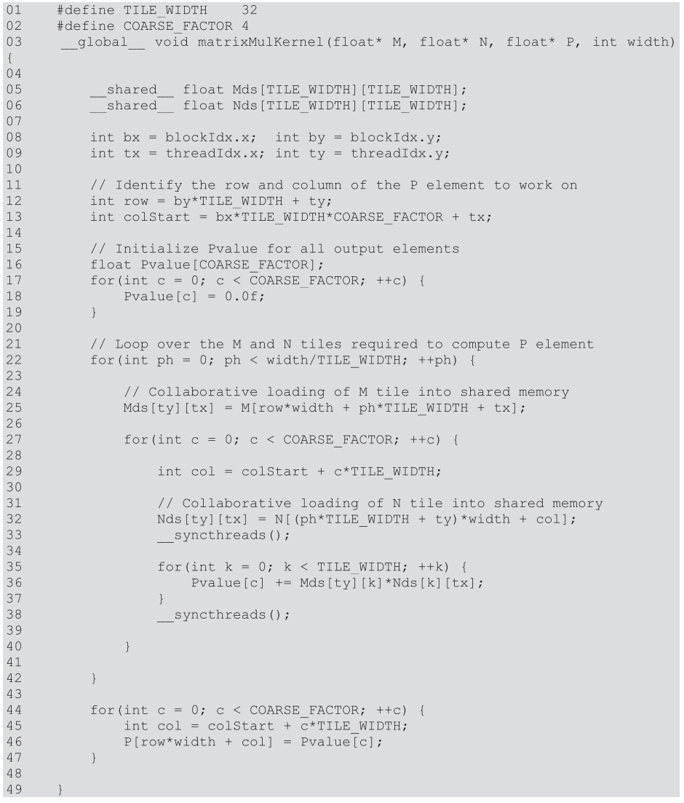

# Excercises 6

1. Write a matrix multiplication kernel function that corresponds to the design illustrated in Fig. 6.4.


    ```C++
    static const uint32_t TILE_SIZE = 32;

    __global__ void MatrixMulKernelWithCT(float* M, float * N, float *P, int32_t width){
        __shared__ float M_t[TILE_SIZE][TILE_SIZE];
        __shared__ float N_t[TILE_SIZE][TILE_SIZE];

        uint32_t bx = blockIdx.x;
        uint32_t by = blockIdx.y;
        uint32_t tx = threadIdx.x;
        uint32_t ty = threadIdx.y;

        // Identify the row and column of the P element to work on
        uint32_t Row = by * TILE_SIZE + ty;
        uint32_t Col = bx * TILE_SIZE + tx;

        // Loop
        float Pvalue = 0.0F;
        for(uint32_t ph = 0; ph < width/TILE_SIZE; ++ph){

            M_t[ty][tx] = M[Row*width + ph*TILE_SIZE + tx];
            // Corner Turning Here
            N_t[tx][ty] = N[(ph*TILE_SIZE + ty)*width + Col];
            __syncthreads();

            for(uint32_t k = 0; k < TILE_SIZE; ++k){
                // Revise N_t's index
                Pvalue += M_t[ty][k] * N_t[tx][k];
            }
            __syncthreads();
        }
        P[Row*width+Col] = Pvalue;
    }
    ```

2. For tiled matrix multiplication, of the possible range of values for BLOCK_SIZE, for what values of BLOCK_SIZE will the kernel completely avoid uncoalesced accesses to global memory? (You need to consider only square blocks.)

    ??
    <https://stackoverflow.com/questions/54003653/how-to-avoid-un-coalesced-accesses-in-matrix-multiplication-cuda-kernel>

3. Consider the following CUDA kernel: For each of the following memory accesses, specify whether they are coalesced or uncoalesced or coalescing is not applicable:

    ```C++
    __global void foo_kernel(float* a, float* b, float* c, float* d, float* e){
        uint32_t i = blockIdx.x*blockDim.x + threadIdx.x;
        __shared__ float a_s[256];
        __shared__ float bc_s[4*256];
        a_s[threadIdx.x] = a[i];
        for(uint32_t j = 0; j < 4; ++j) {
            bc_s[j*256 + threadIdx.x] = b[j*blockDim.x*gridDim.x + i] + c[i*4 + j];
        }

        __syncthreads();
        d[i + 8] = a_s[threadIdx.x];
        e[i*8] = bc_s[threadIdx.x*4];
    }
    ```

    a. The access to array a of line 05     **coalesced**

        For warp-i:
        Thread-0, a[i]
        Thread-1, a[i+1]
        Thread-2, a[i+2]
        ......
        Thread-31, a[i+31]
        So a is coalesced.

    b. The access to array a_s of line 05   **coalesced**

        Same as a.

    c. The access to array b of line 07     

        For warp-i:
        Thread-0, b[i+0],b[i+blockDim.x*gridDim.x+0],b[i+2*blockDim.x*gridDim.x+0],b[i+3*blockDim.x*gridDim.x+0]
        Thread-1, b[i+1],b[i+blockDim.x*gridDim.x+1],b[i+2*blockDim.x*gridDim.x+1],b[i+3*blockDim.x*gridDim.x+1]
        Thread-2, b[i+2],b[i+blockDim.x*gridDim.x+2],b[i+2*blockDim.x*gridDim.x+2],b[i+3*blockDim.x*gridDim.x+2]
        ......
        Thread-31, b[i+31],b[i+blockDim.x*gridDim.x+31],b[i+2*blockDim.x*gridDim.x+31],b[i+3*blockDim.x*gridDim.x+31]
        So c is coalesced.

    d. The access to array c of line 07     **coalesced**

        For warp-i:
        Thread-0, c[i+0],c[i+1],c[i+2],c[i+3]
        Thread-1, c[i+4],c[i+5],c[i+6],c[i+7]
        Thread-2, c[i+8],c[i+9],c[i+10],c[i+11]
        ......
        Thread-31, c[i+124],c[i+125],c[i+126],c[i+127]
        So d is uncoalesced.

    e. The access to array bc_s of line 07  **coalesced** bc_s[j*256 + threadIdx.x]

        For warp-i:
        Thread-0, bc_s[i+0],bc_s[256+i+0],bc_s[2*256+i+0],bc_s[3*256+i+0]
        Thread-1, bc_s[i+1],bc_s[256+i+1],bc_s[2*256+i+1],bc_s[3*256+i+1]
        Thread-2, bc_s[i+2],bc_s[256+i+2],bc_s[2*256+i+2],bc_s[3*256+i+2]
        ......
        Thread-31, bc_s[i+31],bc_s[256+i+31],bc_s[2*256+i+31],bc_s[2*256+i+31]
        So e is coalesced.

    f. The access to array a_s of line 10   **coalesced**

        For warp-i:
        Thread-0, a_s[(i+0)]
        Thread-1, a_s[(i+1)]
        Thread-2, a_s[(i+2)]
        ......
        Thread-31, a_s[(i+31)]
        So f is coalesced.

    g. The access to array d of line 10     **coalesced**

        For warp-i:
        Thread-0, d[(i+0)+8]
        Thread-1, d[(i+1)+8]
        Thread-2, d[(i+2)+8]
        ......
        Thread-31, d[(i+31)+8]
        So g is coalesced.

    h. The access to array bc_s of line 11  **coalesced**

        For warp-i:
        Thread-0, bc_s[4*(i+0)]
        Thread-1, bc_s[4*(i+1)]
        Thread-2, bc_s[4*(i+2)]
        ......
        Thread-31, bc_s[4*(i+31)]
        So h is uncoalesced.

    i. The access to array e of line 11     **coalesced**

        For warp-j:
        Thread-0, e[(i+0)*8]
        Thread-1, e[(i+1)*8]
        Thread-2, e[(i+2)*8]
        ......
        Thread-31, e[(i+31)*8]
        So i is uncoalesced.

4. What is the floating point to global memory access ratio (in OP/B) of each of the following matrix-matrix multiplication kernels?

    a. The simple kernel described in Chapter 3, Multidimensional Grids and Data, without any optimizations applied.
    

        Floating-operation: Width*(1plus + 1mul)*(Width*Width) = 2Width^3 OP;
        Memory-access: Width*Width*(Width+Width) = 2Width^3 Bytes;
        OP/B =  2Width^3/2Width^3 = 1 OP/B

    b. The kernel described in Chapter 5, Memory Architecture and Data Locality, with shared memory tiling applied using a tile size of 32 * 32.
        

        Floating-operation: Width*(1plus + 1mul)*(Width*Width) = 2Width^3 OP;
        Memory-access: (Width*32*2)*((Width*Width)/(32*32)) = 64Width*(Width^2)/1024 = Width^3/16;
        OP/B =  2Width^3/(Width^3/16) = 32 OP/B

    c. The kernel described in this chapter with shared memory tiling applied using a tile size of 32 * 32 and thread coarsening applied using a coarsening factor of 4.
        
        
        Floating-operation: Width*(1plus + 1mul)*(Width*Width) = 2Width^3 OP;
        Memory-access: (Width*32*2)*((Width*Width)/(32*32)) = 64Width*(Width^2)/1024 = Width^3/16;
        OP/B =  2Width^3/(Width^3/16) = 32 OP/B
