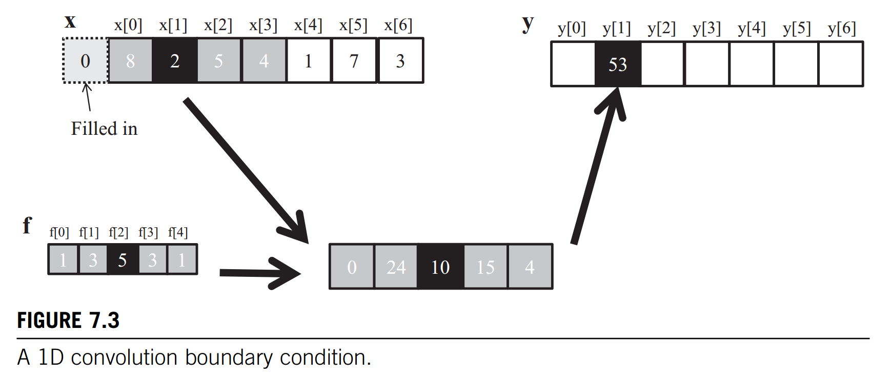

# Excercises-7

1. Calculate the P[0] value in Fig. 7.3.


    P[0] = 0 + 0 + 8*5 + 2*3 + 5*1 = 40 + 6 + 5 = 51

2. Consider performing a 1D convolution on array N = {4,1,3,2,3} with filter F = {2,1,4}. What is the resulting output array?

    P[0] = 0\*2 + 4\*1 + 1\*4 = 9;

    P[1] = 4\*2 + 1\*1 + 3\*4 = 21;

    P[2] = 1\*2 + 3\*1 + 2\*4 = 13;

    P[3] = 3\*2 + 2\*1 + 3\*4 = 20;

    P[4] = 2\*2 + 3\*1 + 0\*4 = 7;

    P = [9, 21, 13, 20, 7]

3. What do you think the following 1D convolution filters are doing?

    a. [0 1 0] 保持原样

    b. [0 0 1] 右移一位

    c. [1 0 0] 左移一位

    d. [-1/2 0 1/2] 求导

    e. [1/3 1/3 1/3] 加权平均

4. Consider performing a 1D convolution on an array of size N with a filter of size M:

    a. How many ghost cells are there in total?

    $$2\lfloor \frac{M}{2} \rfloor$$

    b. How many multiplications are performed if ghost cells are treated as multiplications (by 0)?

    $$NM$$

    c. How many multiplications are performed if ghost cells are not treated as multiplications?

    $$NM- 2\sum^{\lfloor \frac{M}{2} \rfloor-1}_{i=1}{i}$$

5. Consider performing a 2D convolution on a square matrix of size N × N with a square filter of size M × M:

    Supposed $r = \lfloor \frac{M}{2} \rfloor$

    a. How many ghost cells are there in total?

    $$[(N+2r)^2-N^2]=(4Nr+4r^2)=4r(N+r)$$

    b. How many multiplications are performed if ghost cells are treated as multiplications (by 0)?

    $$(N*N)*(M*M) = (NM)^2$$

    c. How many multiplications are performed if ghost cells are not treated as multiplications?

    For boundary:
    $$(N-2r)\sum^{r}_{i=1}{(iM)}$$

    For Corners:

    $$\sum^{r}_ {i=1} \sum^{r}_ {j=1}((r-i+1)M+(M-r)(r-j+1))$$

    So:
    $$N^2M^2-4[(N-2r)\sum^{r}*{i=1}{(iM)}+\sum^{r}* {i=1} \sum^{r}_ {j=1}((r-i+1)M+(M-r)(r-j+1))]$$

6. Consider performing a 2D convolution on a rectangular matrix of size $N_1×N_2$ with a rectangular mask of size $M_1×M_2$:

    For x-axis, extra length is $r_x = \lfloor \frac{M_1}{2} \rfloor$,

    For y-axis, extra length is $r_y = \lfloor \frac{M_2}{2} \rfloor$

    a. How many ghost cells are there in total?

    $$[(N_1+2r_x)\times (N_2+2r_y)-N_1\times N_2] = [(N_1N_2+2N_1r_y+2N_2r_x+4r_xr_y)-N_1N_2]$$

    $$=2N_1r_y+2N_2r_x+4r_xr_y$$

    b. How many multiplications are performed if ghost cells are treated as multiplications (by 0)?

    $$N_1\times N_2 \times M_1 \times M_2 = N_1N_2M_1M_2$$

    c. How many multiplications are performed if ghost cells are not treated as multiplications?

    For x-axis:
    $$(N_2-2r_y)\sum^{r_x}_{i=1}{(iM_2)}$$

    For y-axis:
    $$(N_1-2r_x)\sum^{r_y}_{i=1}{(iM_1)}$$

    For Corners:

    $$\sum^{r_x}_ {i=1} \sum^{r_y}_ {j=1}((r_1-i+1)M_2+(M_1-r_1)(r_2-j+1))$$

    So:
    $$N_1N_2M_1M_2-2[(N_2-2r_y)\sum^{r_x}_ {i=1}{(iM_2)}+(N_1-2r_x)\sum^{r_y}_ {i=1}{(iM_1)}+2\sum^{r_x}_ {i=1} \sum^{r_y}_ {j=1}((r_1-i+1)M_2+(M_1-r_1)(r_2-j+1))]$$

7. Consider performing a 2D tiled convolution with the kernel shown in Fig. 7.12 on an array of size N × N with a filter of size M × M using an output tile of size T × T.

    ```C++
    #define IN_TILE_DIM 32
    #define FILTER_RADIUS 2
    #define OUT_TILE_DIM ((IN_TILE_DIM)-2 * (FILTER_RADIUS))

    __constant__ float F_c[2 * FILTER_RADIUS + 1][2 * FILTER_RADIUS + 1];
    __global__ void convolution_tiled_2D_const_mem_kernel(float *N, float *P, int32_t width, int32_t height)
    {
        // Setting indices
        int32_t col = blockIdx.x * OUT_TILE_DIM + threadIdx.x - FILTER_RADIUS;
        int32_t row = blockIdx.y * OUT_TILE_DIM + threadIdx.y - FILTER_RADIUS;

        // loading input file
        __shared__ float N_s[IN_TILE_DIM][IN_TILE_DIM];
        if (row >= 0 && row < height && col >= 0 && col < width)
        { // Store 8*8 data
            N_s[threadIdx.y][threadIdx.x] = N[row * width + col];
        }
        else
        { // Setting Ghost cell
            N_s[threadIdx.y][threadIdx.x] = 0.0F;
        }
        __syncthreads();

        // Calculating output elements
        int32_t tileCol = threadIdx.x - FILTER_RADIUS;
        int32_t tileRow = threadIdx.y - FILTER_RADIUS;

        // turning off the threads at the edges of the block
        if (col >= 0 && col < width && row >= 0 && row < height)
        {
            if (tileCol >= 0 && tileCol < OUT_TILE_DIM && tileRow >= 0 && tileRow < OUT_TILE_DIM)
            {
                float Pvalue = 0.0F;
                for (int32_t fRow = 0; fRow < 2 * FILTER_RADUIS + 1; fRow++)
                {
                    for (int32_t fRow = 0; fRow < 2 * FILTER_RADUIS + 1; fRow++)
                    {
                        Pvalue += F[fRow][fCol] * N_s[tileRow + fRow][tileCol + fCol];
                    }
                }
                P[row * width + col] = Pvalue;
            }
        }
    }
    ```

    a. How many thread blocks are needed?

    $$\frac{N\times N}{T\times T}=\frac{N^2}{T^2}$$

    b. How many threads are needed per block?

    $$T^2$$

    c. How much shared memory is needed per block?

    $$4Bytes \times (T * T) = 4T^2 Bytes$$

    d. Repeat the same questions if you were using the kernel in Fig. 7.15.

    a:
        $$\frac{N\times N}{T\times T}=\frac{N^2}{T^2}$$
    b:
        $$T^2$$
    c:
        $$4Bytes \times (T * T) = 4T^2 Bytes$$

    ```C++
    #define TILE_DIM 32
    #define FILTER_RADIUS 2
    __constant__ float F_c[2 * FILTER_RADIUS + 1][2 * FILTER_RADIUS + 1];
    __global__ void convolution_cached_tiled_2D_const_mem_kernel(float *N, float *P, int32_t width, int32_t height)
    {
        // Setting indices
        int32_t col = blockIdx.x * TILE_DIM + threadIdx.x;
        int32_t row = blockIdx.y * TILE_DIM + threadIdx.y;

        // loading input file
        __shared__ float N_s[TILE_DIM][TILE_DIM];
        if (row >= 0 && row < height && col >= 0 && col < width)
        { // Store 8*8 data
            N_s[threadIdx.y][threadIdx.x] = N[row * width + col];
        }
        else
        { // Setting Ghost cell
            N_s[threadIdx.y][threadIdx.x] = 0.0F;
        }
        __syncthreads();

        // Calculating output elements
        // turning off the threads at the edges of the block
        if (col < width && row < height)
        {
            float Pvalue = 0.0F;
            for (int32_t fRow = 0; fRow < 2 * FILTER_RADUIS + 1; fRow++)
            {
                for (int32_t fCol = 0; fCol < 2 * FILTER_RADUIS + 1; fCol++)
                {
                    if (threadIdx.x - FILTER_RADIUS + fCol >= 0 &&
                        threadIdx.x - FILTER_RADIUS + fCol < TILE_DIM &&
                        threadIdx.y - FILTER_RADIUS + fRow >= 0 &&
                        threadIdx.y - FILTER_RADIUS + fRow < TILE_DIM)
                    {
                        Pvalue += F[fRow][fCol] * N_s[threadIdx.y + fRow][threadIdx.x + fCol];
                    }
                    else
                    {
                        if (row - FILTER_RADIUS + fRow >= 0 &&
                            row - FILTER_RADIUS + fRow < height &&
                            col - FILTER_RADIUS + fCol >= 0 &&
                            col - FILTER_RADIUS + fCol < width)
                        {
                            Pvalue += F[fRow][fCol] * 
                            N_s[(row - FILTER_RADIUS + fRow) * width + (col - FILTER_RADIUS + fCol)];
                        }
                    }
                }
            }
            P[row * width + col] = Pvalue;
        }
    }
    ```

8. Revise the 2D kernel in Fig. 7.7 to perform 3D convolution.

    ```C++
    __global__ void
    convolution_2D_basic_kernel(float *N, float *F, float *P, int32_t r, int32_t width, int32_t height){
    // Output index also input center index
        int32_t outCol = blockIdx.x*blockDim.x + threadIdx.x;
        int32_t outRow = blockIdx.y*blockDim.y + threadIdx.y;
        // Store calculate value
        float Pvalue = 0.0F;

        // For each row;
        for(uint32_t fRow = 0; fRow < 2*r+1; fRow++){
            // For each col value;
            for(uint32_t fCol = 0; fCol < 2*r+1; fCol++){
                // Current input data array index(inRow, inCol)
                inRow = outRow - r + fRow;
                inCol = outCol - r + fCol;
                // Setting bandary conditions include col and row;
                if(inRow >= 0 && inRow < height && inCol >= 0 && inCol < width){
                    // Pvalue = Fwith output index * N width current index;
                    Pvalue += F[fRow][fCol]*N[inRow*width + inCol];
                }
            }
        }
        // Output Pvalue
        P[outRow][outCol] = Pvalue;
    }
    ```

    ```C++
    __global__ void
    convolution_3D_basic_kernel(float *N, float *F, float *P, int32_t r, int32_t width, int32_t height, int32_t level)
    {
        // Output index also input center index
        int32_t outCol = blockIdx.x * blockDim.x + threadIdx.x;
        int32_t outRow = blockIdx.y * blockDim.y + threadIdx.y;
        int32_t outLevel = blockIdx.z * blockDim.z + threadIdx.z;
        // Store calculate value
        float Pvalue = 0.0F;

        // For each row;
        for (uint32_t fRow = 0; fRow < 2 * r + 1; fRow++)
        {
            // For each col value;
            for (uint32_t fCol = 0; fCol < 2 * r + 1; fCol++)
            {
                // For each level value;
                for (uint32_t fLevel = 0; fLevel < 2 * r + 1; fLevel++)
                {
                    // Current input data array index(inRow, inCol, inLevel)
                    inRow = outRow - r + fRow;
                    inCol = outCol - r + fCol;
                    inLevel = outLevel - r + fLevel;
                    // Setting bandary conditions include col and row;
                    if ((inRow >= 0 && inRow < height) && (inCol >= 0 && inCol < width) && (inLevel >= 0 && inLevel < level))
                    {
                        // Pvalue = Fwith output index * N width current index;
                        Pvalue += F[fRow][fCol][fLevel] * N[(level * height + inRow) * width + inCol];
                    }
                }
            }
        }
        // Output Pvalue
        P[outRow][outCol][outLevel] = Pvalue;
    }
    ```

9. Revise the 2D kernel in Fig. 7.9 to perform 3D convolution.

    ```C++
    __global__ void
    convolution_2D_const_mem_kernel(float *N, float*P, int32_t r, int32_t width, int32_t height){

        int32_t outCol = blockIdx.x*blockDim.x + threadIdx.x;
        int32_t outRow = blockIdx.y*blockDim.y + threadIdx.y;
        float Pvalue = 0.0F;

        for(uint32_t fRow = 0; fRow < 2*r+1; fRow++){
            for(uint32_t fCol = 0; fCol < 2*r+1; fCol++){
                // Current input data array index(inRow, inCol)
                inRow = outRow - r + fRow;
                inCol = outCol - r + fCol;
                // Setting bandary conditions include col and row;
                if(inRow >= 0 && inRow < height && inCol >= 0 && inCol < width){
                    // Pvalue = Fwith output index * N width current index;
                    Pvalue += F[fRow][fCol]*N[inRow*width + inCol];
                }
            }
        }
        // Output Pvalue
        P[outRow][outCol] = Pvalue;
    }
    ```

    ```C++
    __global__ void
    convolution_3D_const_mem_kernel(float *N, float *P, int32_t r, int32_t width, int32_t height, int32_t level)
    {

        int32_t outCol = blockIdx.x * blockDim.x + threadIdx.x;
        int32_t outRow = blockIdx.y * blockDim.y + threadIdx.y;
        int32_t outLevel = blockIdx.z * blockDim.z + threadIdx.z;

        float Pvalue = 0.0F;

        for (uint32_t fRow = 0; fRow < 2 * r + 1; fRow++)
        {
            for (uint32_t fCol = 0; fCol < 2 * r + 1; fCol++)
            {
                // For each level value;
                for (uint32_t fLevel = 0; fLevel < 2 * r + 1; fLevel++)
                {
                    // Current input data array index(inRow, inCol)
                    inRow = outRow - r + fRow;
                    inCol = outCol - r + fCol;
                    inLevel = outLevel - r + fLevel;
                    // Setting bandary conditions include col and row;
                    if ((inRow >= 0 && inRow < height) && (inCol >= 0 && inCol < width) && (inLevel >= 0 && inLevel < level))
                    {
                        // Pvalue = Fwith output index * N width current index;
                        Pvalue += F[fRow][fCol][fLevel] * N[(level * height + inRow) * width + inCol];
                    }
                }
            }
        }
        // Output Pvalue
        P[outRow][outCol] = Pvalue;
    }
    ```

10. Revise the tiled 2D kernel in Fig. 7.12 to perform 3D convolution.

    ```C++
    #define IN_TILE_DIM 32
    #define FILTER_RADIUS 2
    #define OUT_TILE_DIM ((IN_TILE_DIM)-2 * (FILTER_RADIUS))

    __constant__ float F_c[2 * FILTER_RADIUS + 1][2 * FILTER_RADIUS + 1];
    __global__ void convolution_tiled_2D_const_mem_kernel(float *N, float *P, int32_t width, int32_t height)
    {
        // Setting indices
        int32_t col = blockIdx.x * OUT_TILE_DIM + threadIdx.x - FILTER_RADIUS;
        int32_t row = blockIdx.y * OUT_TILE_DIM + threadIdx.y - FILTER_RADIUS;

        // loading input file
        __shared__ float N_s[IN_TILE_DIM][IN_TILE_DIM];
        if (row >= 0 && row < height && col >= 0 && col < width)
        { // Store 8*8 data
            N_s[threadIdx.y][threadIdx.x] = N[row * width + col];
        }
        else
        { // Setting Ghost cell
            N_s[threadIdx.y][threadIdx.x] = 0.0F;
        }
        __syncthreads();

        // Calculating output elements
        int32_t tileCol = threadIdx.x - FILTER_RADIUS;
        int32_t tileRow = threadIdx.y - FILTER_RADIUS;

        // turning off the threads at the edges of the block
        if (col >= 0 && col < width && row >= 0 && row < height)
        {
            if (tileCol >= 0 && tileCol < OUT_TILE_DIM && tileRow >= 0 && tileRow < OUT_TILE_DIM)
            {
                float Pvalue = 0.0F;
                for (int32_t fRow = 0; fRow < 2 * FILTER_RADUIS + 1; fRow++)
                {
                    for (int32_t fRow = 0; fRow < 2 * FILTER_RADUIS + 1; fRow++)
                    {
                        Pvalue += F[fRow][fCol] * N_s[tileRow + fRow][tileCol + fCol];
                    }
                }
                P[row * width + col] = Pvalue;
            }
        }
    }
    ```

    ```C++
    __constant__ float F_c[2 * FILTER_RADIUS + 1][2 * FILTER_RADIUS + 1][2 * FILTER_RADIUS + 1];
    __global__ void convolution_tiled_3D_const_mem_kernel(float *N, float *P, int32_t width, int32_t height, int32_t length)
    {
        // Setting indices
        int32_t col = blockIdx.x * OUT_TILE_DIM + threadIdx.x - FILTER_RADIUS;
        int32_t row = blockIdx.y * OUT_TILE_DIM + threadIdx.y - FILTER_RADIUS;
        int32_t level = blockIdx.z * OUT_TILE_DIM + threadIdx.z - FILTER_RADIUS;

        // loading input file
        __shared__ float N_s[IN_TILE_DIM][IN_TILE_DIM][IN_TILE_DIM];
        if ((row >= 0 && row < height) && (col >= 0 && col < width) && (level >= 0 && level < length))
        { // Store 8*8 data
            N_s[threadIdx.z][threadIdx.y][threadIdx.x] = N[(level * height + row) * width + col];
        }
        else
        { // Setting Ghost cell
            N_s[threadIdx.z][threadIdx.y][threadIdx.x] = 0.0F;
        }
        __syncthreads();

        // Calculating output elements
        int32_t tileCol = threadIdx.x - FILTER_RADIUS;
        int32_t tileRow = threadIdx.y - FILTER_RADIUS;
        int32_t tileLevel = threadIdx.z - FILTER_RADIUS;

        // turning off the threads at the edges of the block
        if ((row >= 0 && row < height) && (col >= 0 && col < width) && (level >= 0 && level < length))
        {
            if (tileCol >= 0 && tileCol < OUT_TILE_DIM && tileRow >= 0 && tileRow < OUT_TILE_DIM && tileLevel >= 0 && tileLevel < OUT_TILE_DIM)
            {
                float Pvalue = 0.0F;
                for (int32_t fRow = 0; fRow < 2 * FILTER_RADUIS + 1; fRow++)
                {
                    for (int32_t fCol = 0; fCol < 2 * FILTER_RADUIS + 1; fCol++)
                    {
                        for (int32_t fLevel = 0; fLevel < 2 * FILTER_RADUIS + 1; fLevel++)
                        {
                            Pvalue += F[fRow][fCol][fLevel] * N_s[tileRow + fRow][tileCol + fCol][tileCol + fLevel];
                        }
                    }
                }
                P[(level * height + row) * width + col] = Pvalue;
            }
        }
    }
    ```

----
最近课题比较紧张，后面的暂时不做了

## Extra question

1. TILED 1D convolution with halo cells

2. TILED 3D convolution with halo cells

3. The second approach launches blocks whose dimension matches that of the output tiles Design.
